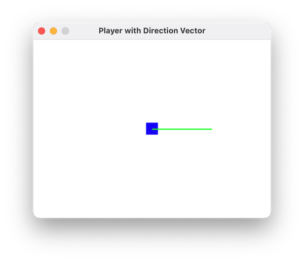

# Vector Example Program

( Use "Open Preview" to see the images in this document. )

The program `03_vectors.py` is a simple program that demonstrates how
to use vectors to move an object around the screen.



You can move the green line around the player with the left and right arrow
keys. The up and down arrow keys will make the line longer or shorter. When you
hit the space bar, the player will move along the green line to the new
position.

As you play with the program and move the line around, notice the replationship
between the X and Y components of vector and the direction and magnitude of the
line. For instance: 

* If the direction is a 45° angle, the X and Y components of the vector
  will be equal.
* If the direction is 90° or -90°, the X component will be zero, and the Y
  component will be the magnitude of the vector.
* If the direction is 0° or 180° / -180°, the Y component will be zero, and the
  X component will be the magnitude of the vector.
* At 30°, the magnitude ( length ) of the vector will be twice the Y component,
  and at 60°, the magnitude will be twice the X component.
  
After experimenting with the program, read the cod to figure out how it works. 

## Gravity Bounce Update

The program `04_gravity_bounce_vec.py` is an update to the gravity
bounce program that uses vectors to represent the player's position and
velocity. Open it and compare it to the previous gravity bounce program to see
how vectors can simplify the code.


## Assignment 1

1. Open `04_gravity_bounce_vec.py` 
2. Add drag to the program, like we did in lesson 01, but use a
   vector to represent the drag. Subtract the drag vector from the player's
   velocity each time step to make the player slow down. 

Your drag can be configured with a scalar value ( a float ) that is turned into
a vector in the Player class initializer, or in the Game class.  Be sure to use
the drag vector to modify the player's velocity in the appropriate method. 

Remember that drag works a lot like thrust: it is a vector that you subtract 
from the player's velocity. The drag vector should point in the opposite direction
of the player's velocity, and its magnitude should be proportional to the player's
velocity.

If you want a more sophisticated, realistic drag, you can make the drag vector
proportional to the square of the player's velocity. This is a simple model of
air resistance, which is proportional to the square of the velocity.

Hints:
* The easiest drag vector is just the negative of the player's velocity, divided
  by a scalar value. The negative will make it point in the opposite direction
  of the player's velocity, and the scalar value will determine how strong the
  drag is. So you might use something like `drag = -velocity * 0.1` to make the
  drag 10% of the player's velocity.

## Assignment 2

Now we are going to add thrust to the player. The player will have a thrust
vector that will be added to the player's velocity when the player presses the
space bar. This will work just like the drag vector, except you will add the
thrust vector instead of subtract it, and you will add the thrust vector only
when the player jumps, rather than subtracting a little bit every time step. 

While drag is usually in the opposite direction of the player's velocity, thrust
can be in any direction, since thrust is how the play moves where it wants to. 

1. Add a thrust vector to the player class. For now, just make the the thrust
   vector point up. 
2. Remove the logic that causes continuous jumping. After the player touches the
   ground, the player should stop and not bounce. 
3. Add a method to the Player, `update_input(self)` that will read the keys.
   Call this method along with the other update functions in `update()` If the
   player presses the space bar, add the thrust vector to the player's velocity.
   Read the code in `03_vectors.py` to see how get the keys.

### Things to try

* Change the direction of the thrust vector. You might have the vector point
  straight up, so the player can only jump up, but you can change the direction
  to the player jumps in a different direction. Make the player jump sideways.

## Assignment 3

Let's update the program to allow the user to jump in any direction. For this,
we will use the example from  `03_vectors.py`. In the example
program, the player moves along the green line when the space bar is pressed.
Instead of moving along the line, we will add a thrust vector to the player's
velocity when the space bar is pressed.

1. First, copy your existing gravity bounce program to a new file, so you can
   keep your existing work.
2. Add a line that represents the thrust vector, which you will draw on the
   screen to show the player which way they are jumping, just like in the
   `03_vectors.py` example.
3. Update your `update_input()` method to read the arrow keys and adjust the
   thrust vector. You can use the left and right arrow keys to change the
   direction of the thrust vector, and the up and down arrow keys to change the
   length of the thrust vector. Review the code in `03_vectors.py` for hints.

So, for this progam , the player can move the green line around, just like in
the `03_vectors.py` program, but when the player hits the space bar, the player
will move in the direction of the green line, with a velocity proportional to
the length of the green line. The player should continue moving untill stopped
by drag and gravity. 


### Things to try

Does your thrust vector line look right? Does it start drawing from the center of the player? Is
it long enough to see? Is it the right color? You might have to adjust the starting point, 
and increase the length of the line to make it visible.


## Assignment 4

Let's turn our gravity jumper into a space game. The force of gravity is, from
Newton's Law of Gravitation:


Where `F` is the force of gravity, `G` is the gravitational constant, `m_1` and
`m_2` are the masses of the two objects, and `r` is the distance between the two
objects. 

Whew! That might look complicated ... but for us, only one part of this equation
is important: the force of gravity is proportional to `1/r^2`. This means that
the force of gravity gets weaker as you move away from the center of the planet.
We can adjust the other parts of the formula to make it look right, but we will
need to calculate the force of gravity as a vector, with 1/r^2 in the formula. 

He is what that might look like in code:

```python
import pygame

# Create a vector v
v = pygame.math.Vector2(3, 4)

# Calculate the magnitude (r) of the vector
r = v.length()

# Avoid division by zero by checking if r is non-zero
if r != 0:
    # Scale the vector by 1 / r^2
    v_scaled = v * (1 / r**2)
else:
    v_scaled = pygame.math.Vector2(0, 0)  # Handle zero-length vector if necessary

# Output the scaled vector
print(v_scaled)
```


1. Move the gravity vector from the Game to the Player
2. Create a method `Game.vec_to_center(self, pos) -> Vector` that will return a
   vector that points from the player's position to the center of the screen.
3. Add a method to Player to calculate the gravity vector. This method should
   return a vector that points from the player's position to the center of the
   screen, with a magnitude that is proportional to 1/r^2, where r is the
    distance from the player to the center of the screen. 
4. Add a "planet" to the screen. The planet should be a circle that is drawn at
   the center of the screen. You should add a method `Game.draw()` that will
    draw the planet, and be sure to call it from `Game.run()`
5. Make the thrust vector point in the right direction for a spaceship, so 
   the spaceship move in the opposite direction of the thrust vector.

