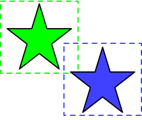

# Collisions

So far, our games have just involved moving things aobut a screen, but there
haven't been any crashes or explosions. In this lesson, we will explore the
concept of collisions in game development using Python. Collisions are a
fundamental aspect of many games, determining when objects interact with each
other.

Collisions occur when two or more objects come into contact with each other. In
games, detecting collisions is crucial for various interactions, such as player
movements, enemy attacks, and object pickups.

- **Bounding Box Collisions**: Simplest form, using rectangles or boxes around objects.
- **Circle Collisions**: Using circles to detect overlaps, often used for circular objects.
- **Pixel Perfect Collisions**: More precise, checking individual pixels for overlap.

The first two types of collections are the most common, because they are very
fast, but they are not always the most accurate. Pixel perfect collisions are
the most accurate, but they are also the slowest.

Suppose you have two sprites, in the shape of stars: 



The dotted line around each sprite represents the bounding box, which is the
rectangle that surrounds the sprite's image. In the diagram, you can see that the
bounding boxes are overlapping, which means that the sprites are colliding, but
the images of the sprites are not touching. So, the computer thinks there is a
collision, but the player does not! This is why bounding box collisions are not
always the most accurate. However, it's really easy, so we'll learn those first. 

For an example of bounding box collisions, see the code in
`examples/dino_jump.py`. This dino jump game is really terrible! It's clearly
not finished, but it does show you how collisions work. 

Here is the code that checks for collisions in the game:

```python

    obstacles = pygame.sprite.Group() # Create obstacles group

    ...

    obstacle = Obstacle() # Add obstacles to a group
    obstacles.add(obstacle)

    ...

    # Check collisions
    collider = pygame.sprite.spritecollide(player, obstacles, dokill=False)
    if collider:
        collider[0].explode()

```

All of the obstacles are in the `obstacles` group. The `spritecollide` function
checks for collisions between the player and the obstacles. If there is a
collision, it returns a list of the colliding objects. In this case, we only
have one obstacle, so we can just get the first object in the list.
       

## Assignment 1

1. Copy `07_dino_jump.py` to this directory
2. Make the game properly object oriented, like other games have been. There should be a class for all of the major parts, including a `Game` object that has the main loop, and an object for settings. 
3. Make the player jump when the space bar is pressed, rather than move up and down with the arrow keys. 
4. Add a `score` attribute to the player object, and update it for each obstacle that is avoided.
5. Change the player to a dinosaur and the obstacles to cactuses or pterodactyls.
6. Add a game over screen when the player collides with an obstacle.
7. Add a restart button to the game over screen.
8. Add a high score to the game over screen.
9. Draw a ground for the dinosaur to run on.


## More Rectangles

The Rect object, which our sprites use for their position and size, has a number of useful methods for working with rectangles. The first things is that in addition to `.x` and `.y` for thei position of the rect's upper left corner, there are also `.left`, `.right`, `.top`, and `.bottom` attributes. These are the x and y coordinates of the left, right, top, and bottom edges of the rectangle. YOu can both read and write these attributes, so here is a nice way to see if a retangle is off the screen:

```python

screen_rect = screen.get_rect()

if player.rect.right < screen_rect.left:
    player.rect.left = screen_rect.right

if player.rect.left > screen_rect.right:
    player.rect.right = screen_rect.left

 ... etc ...

```

To move the rectangle, we have been using assignment to the `.x` and `.y` attributes, but we can also use the `.move` method. This method takes two arguments, the amount to move in the x and y directions, and returns a new rectangle that is the result of moving the original rectangle by that amount. Here is an example:

```python

player.rect = player.rect.move(1, 0)

```

Note that this creats a *new* rect, and does not change the original rect, so you need to assign the result back to the original rect. But, there is also the `.move_ip` method, which stands for "move in place". This method takes the same arguments as `.move`, but it changes the original rect. Here is an example:

```python

player.rect.move_ip(1, 0)

```

There are many other operations to perform on rectangles, such as `inflate`, `clamp`, `clip`, and `union`. You can read about them in the [Pygame documentation](https://www.pygame.org/docs/ref/rect.html#pygame.Rect).


## Assignment 2

1. Copy your dino jump game to a new file.
2. Instead of jumping, make the player into a spaceship that can thrust up or
   down, with gravity that pulls the player back down.
3. Make the obstacles into asteroids that move from right to left, and different heights. 
4. Make the asteroids rotate as they move.
5. Let the player shoot bullets that destroy the asteroids.

### Hints

Read the [Pygame documentation for drawing](https://www.pygame.org/docs/ref/draw.html) to the screen and surfaces. 

You can find more images in the `examples/assets` directory, or you can look for images on the web. 

You can scale ( make bigger or smaller )  and rotate images using the `pygame.transform` module. 

```python
image = pygame.image.load('image.png')

image = pygame.transform.scale(image, (width, height))

image = pygame.transform.rotate(image, angle)
```

