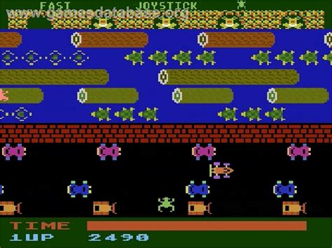

# Frogger

Here are the general rules for the classic arcade game **Frogger**:

Plan an online versino of Frogger [here](https://wcgunter.github.io/Frogger-JS/)
## Objective

The goal of **Frogger** is to guide your frog from the bottom of the screen to
one of the safe zones (or "homes") at the top of the screen, navigating through
various obstacles such as roads with moving vehicles and rivers with floating
objects.

## Gameplay

- **Lives**: Players typically start with 3–5 lives. Each time a frog is hit by
  an obstacle or falls into the water, the player loses a life.
- **Levels**: After successfully guiding all frogs to their homes, the player
  advances to the next level. Each level increases the difficulty by speeding up
  obstacles or adding more complex hazards.

## Game Screen Layout

1. **Starting Area (Bottom)**: This is where the frog begins. The player must
   move upward toward the safe zones at the top.
2. **Road**: Contains lanes of traffic (cars, trucks, motorcycles) moving in
   different directions. The frog must avoid these vehicles.
3. **River**: Features floating logs, turtles, and other objects. The frog must
   jump onto these objects to safely cross the river.
4. **Safe Zones (Top)**: There are multiple homes where the frog can safely
   rest. The player must reach one of these zones to successfully finish a
   frog's journey.

## Controls

- **Movement**: The frog can be moved up, down, left, or right using the arrow
  keys or joystick. Movement is in a grid, one space at a time. That is, if the frog is
  a 32x32 pixel sprite, it moves 32 pixels at a time.

## Rules
1. **Avoid Obstacles**: 
   - The frog must avoid being hit by vehicles while crossing the road.

   - The frog must land on floating logs or turtles to cross the river; falling
     into the water results in losing a life.
   
2. **Time Limit**: 
   - Players must reach the safe zones at the top before the timer runs out. If
     the timer reaches zero, the player loses a life.

3. **Multiple Safe Zones**: 
   - The player must guide multiple frogs to all the safe zones at the top of
     the screen. Each frog must reach a different safe zone.

   - Once all safe zones are filled, the player advances to the next level.

4. **Bonus Points**:
   - Extra points are awarded for faster completions, collecting special items
     (like a fly ), or guiding the frog into the middle home.
   
5. **Hazards in the River**: 
   - Not all objects in the river are safe. Turtles occasionally dive
     underwater, and jumping on them while submerged causes the frog to drown.

6. **Extra Hazards** (in higher levels):
   - Some levels introduce additional hazards like snakes, otters, or
     crocodiles, which can either swim in the river or occupy the safe zones.

## Winning & Losing

- **Winning**: The game continues for as long as the player successfully guides
  frogs to safe zones. There is no definitive "win," as the game is designed to
  get progressively harder.

- **Losing**: The game ends when all lives are lost, either from being hit by vehicles, drowning, running out of time, or being caught by hazards.
