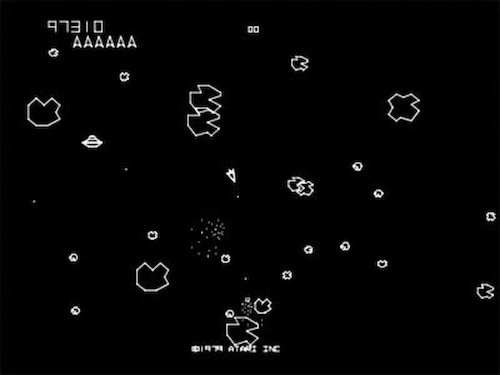

# Asteroids

Here are the general rules for the classic arcade game **Asteroids**:

## Objective

In **Asteroids**, the goal is to survive by piloting a spaceship and destroying all the asteroids and enemy UFOs that appear on the screen. The game continues indefinitely as new waves of asteroids appear after all asteroids in the current wave are destroyed.

## Gameplay

1. **Player's Ship**:
   - The player controls a small triangular spaceship, which can rotate left and right, move forward using thrust, and shoot bullets.
   - The ship has **inertia**, meaning it will continue moving in the last direction it was thrust even after stopping thrusting. The player can only stop by firing thrusters in the opposite direction.
   - The ship can shoot bullets to destroy asteroids and enemy UFOs.

2. **Asteroids**:
   - The game starts with large asteroids floating through space.
   - When a large asteroid is shot, it breaks into smaller pieces (medium asteroids).
   - Medium asteroids, when shot, break into even smaller pieces (small asteroids).
   - Small asteroids are destroyed when hit, and do not split further.
   - Asteroids move at different speeds and in various directions.
   
3. **UFOs (Enemy Ships)**:
   - Occasionally, enemy UFOs appear and shoot at the player's ship.
   - There are two types of UFOs:
     - **Large UFOs**: Easier to hit but shoot inaccurately.
     - **Small UFOs**: More difficult to hit and shoot more accurately at the player.

4. **Screen Wrap**:
   - The game screen wraps around both horizontally and vertically. This means if the player’s ship, an asteroid, or a UFO goes off one side of the screen, it reappears on the opposite side.
   - The player must remain aware that asteroids or enemies can appear from any direction, even behind them.

## Controls

- **Rotate**: The player can rotate the ship left or right.
- **Thrust**: The ship moves forward when the thrust is activated. The ship will continue to move even if the player stops thrusting, due to inertia.
- **Shoot**: The player can fire bullets to destroy asteroids and UFOs. The bullets travel in a straight line until they either hit something or wrap around the screen.
- **Hyperspace**: The player can also use a "hyperspace" feature, which teleports the ship to a random location on the screen. However, this is risky because the ship may reappear in a dangerous position, such as inside an asteroid.

## Rules

1. **Destroy Asteroids**:
   - The player must shoot and destroy all the asteroids on the screen.
   - Large asteroids break into medium asteroids, and medium asteroids break into small asteroids. The player must destroy all sizes of asteroids to clear the wave.
   - When all asteroids are destroyed, a new wave begins with more and faster asteroids.

2. **Avoid Collisions**:
   - The player must avoid colliding with asteroids or enemy UFOs, as a single collision results in the destruction of the player’s ship.
   - Colliding with fragments of an asteroid also results in the destruction of the ship.

3. **Shoot UFOs**:
   - The player can shoot enemy UFOs to earn additional points. However, the UFOs also shoot back, so the player must avoid their attacks.
   - UFOs may appear randomly during any wave of asteroids.

4. **Lives**:
   - The player starts with a limited number of lives (typically 3). Each time the player’s ship is destroyed (by asteroid collision or being shot by a UFO), a life is lost.
   - When all lives are lost, the game is over.

5. **Hyperspace**:
   - The player can use hyperspace to teleport the ship to a random location on the screen. This can help avoid immediate danger, but there is a risk that the ship may reappear in a worse position.

6. **Score**:
   - Points are awarded for each asteroid and UFO destroyed. The smaller the asteroid or enemy UFO, the more points it is worth:
     - Large Asteroid: 20 points
     - Medium Asteroid: 50 points
     - Small Asteroid: 100 points
     - Large UFO: 200 points
     - Small UFO: 1000 points

## Winning & Losing

- **Winning**: There is no final "win" in **Asteroids**—the game continues indefinitely as the player clears waves of asteroids, with the difficulty increasing as the game progresses. The player's goal is to survive as long as possible and achieve a high score.
- **Losing**: The game ends when the player runs out of lives, which happens after the ship is destroyed multiple times.

## Progressive Difficulty

- As the game progresses, the number of asteroids and UFOs increases with each wave.
- Asteroids and UFOs also move faster and become harder to avoid or shoot.
  
Let me know if you'd like more details on any specific aspect!