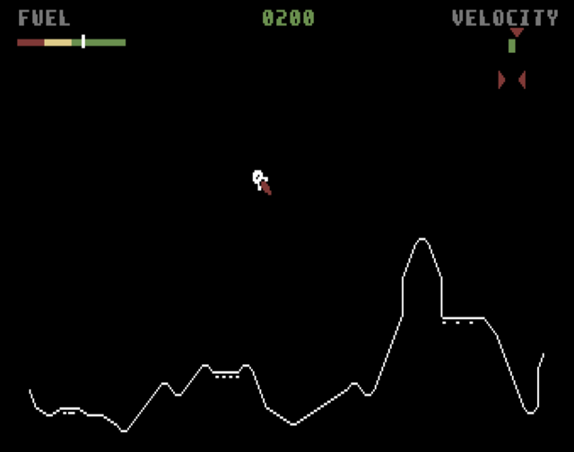

# Lunar Lander

Here are the general rules for the classic arcade game **Lunar Lander**:

## Objective

In **Lunar Lander**, the goal is to safely land a lunar module (spaceship) on the surface of the moon, controlling your descent by managing fuel and avoiding crashing. Points are awarded based on how gently you land and the difficulty of the landing spot.

### Gameplay

1. **Lunar Module**: 
   - The player controls a lunar module that starts at the top of the screen and descends toward the surface of the moon.
   - The module is affected by **gravity**, pulling it toward the moon’s surface. The player must use thrust and rotational controls to adjust the descent speed and orientation.

2. **Fuel**:
   - The lunar module has a limited amount of fuel.
   - Thrusting (firing the rocket engine) consumes fuel, and the player must carefully manage fuel usage to avoid running out before landing.
   - The game ends if the player runs out of fuel before successfully landing.

3. **Landing Zones**:
   - The moon’s surface is rough and uneven, with various marked landing zones.
   - Some zones are easier to land on (flat, larger areas), while others are smaller or located on steep slopes, making them more difficult.
   - Each landing zone has a designated **point value** based on its difficulty—more challenging landing spots reward more points for a successful landing.

## Controls

- **Rotate Left**: The player can rotate the lunar module to the left (counterclockwise).
- **Rotate Right**: The player can rotate the lunar module to the right (clockwise).
- **Thrust**: The player can fire the rocket thrusters to slow the module's descent or move it in a desired direction.

## Rules

1. **Manage Descent**:
   - The player must use thrust to slow down the module’s descent and carefully guide it toward a landing zone.
   - Gravity constantly pulls the module down, so the player must balance the thrust to control the rate of descent and horizontal movement.

2. **Fuel Management**:
   - Thrusting consumes fuel, and the amount of fuel is limited. The player must carefully decide when and how much thrust to use to avoid running out of fuel.
   - Running out of fuel before landing results in the module crashing.

3. **Safe Landing**:
   - To land safely, the player must land with a slow enough vertical and horizontal speed. If the module is moving too fast in any direction when it touches down, it will crash.
   - The game provides feedback on the speed of the descent—if the module is descending too quickly, a crash is imminent.
   
4. **Crash**:
   - A crash occurs if the module hits the surface too fast or lands at an improper angle.
   - Crashing results in no points for that landing and the loss of a life or restart, depending on the game version.

5. **Points and Difficulty**:
   - Successful landings award points based on the landing zone's difficulty and the smoothness of the landing:
     - **Easier zones** (larger and flatter areas) provide fewer points.
     - **Harder zones** (smaller or on rough terrain) provide more points.
   - A very smooth, slow landing earns more points than a rough or fast one.

6. **Game Over**:
   - The game ends when the player runs out of fuel or crashes the module a certain number of times (depending on the version).

7. **Continuous Play**:
   - If the player lands successfully, the game may offer additional landing opportunities with reduced fuel and increased difficulty.

### Winning & Losing

- **Winning**: Like many arcade games, **Lunar Lander** does not have a definitive ending. The objective is to accumulate as many points as possible by performing smooth, successful landings in difficult zones.
- **Losing**: The game ends when:
  - The player runs out of fuel before landing.
  - The player crashes too many times, depending on the game’s life system.
  
