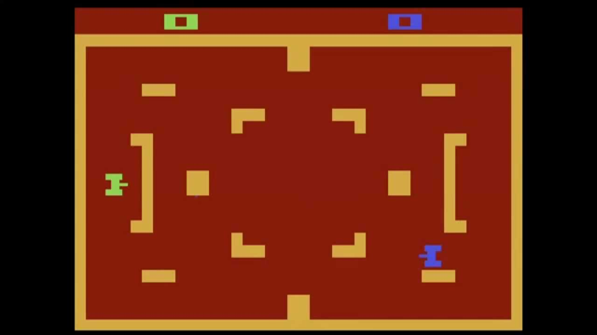

# Tank War

Here are the general rules for a **2-player tank war game**. This genre of game
typically involves two players controlling tanks and battling each other in an
arena until one tank is destroyed or time runs out.

## Objective

The goal of a 2-player tank war game is to destroy the opposing player's tank by shooting it with projectiles while avoiding obstacles and the enemy's attacks. The game usually ends when one player's tank is destroyed or when a set number of rounds or time limit is reached.

## Gameplay

1. **Tanks**:
   - Each player controls a tank on the battlefield.
   - Tanks can move in multiple directions (typically forward, backward, and
     rotate left or right).
   - Each tank has a cannon that fires projectiles (shells) at the opponent.

2. **Arena**:
   - The game takes place in a 2D or 3D arena, which may include walls,
     barriers, and obstacles that affect movement and projectile trajectories.
   - Some arenas may have destructible terrain, meaning obstacles or barriers
     can be destroyed by projectiles.
   - The arena may also contain special features, such as power-ups or hazards
     like mines, that can affect gameplay.

3. **Projectiles**:
   - Each player can fire projectiles from their tank's cannon.
   - Projectiles typically have a limited range and may be affected by obstacles
     in the arena.
   - In some versions, projectiles can ricochet off walls, allowing for strategic shots around corners.
   
4. **Health and Lives**:
   - Each tank has a health bar or a number of lives.
   - Direct hits from the opponent's projectiles reduce the tank's health.
   - When a player's health reaches zero, their tank is destroyed, and the
     opposing player wins the round or game.
   - In some versions, players may have multiple lives, and the game continues
     until all lives are lost.

### Controls

- **Move Forward/Backward**: Moves the tank forward or backward.
- **Rotate Left/Right**: Rotates the tank to change direction.
- **Shoot**: Fires a projectile from the tank's cannon.
- **Special Abilities** (if available): In some games, tanks may have special
  abilities, like laying mines, using shields, or launching special projectiles.

### Rules

1. **Movement and Shooting**:
   - Players can move their tanks around the arena and rotate to face different
     directions.
   - The tank can shoot projectiles, which typically have a cooldown period
     (i.e., a short delay between shots).
   - The projectiles may interact with walls, obstacles, or even bounce off them
     (depending on the game).

2. **Destroy the Opponent's Tank**:
   - The main goal is to shoot and destroy the opposing player's tank.
   - Each projectile hit reduces the opponent's tank health.
   - A round ends when one player's tank is destroyed, or if the game has a time limit, the round may end when the time runs out (the player with more health may win the round).

3. **Obstacles and Cover**:
   - The arena may include obstacles like walls, barriers, or destructible
     objects.
   - Players can use these objects for cover to avoid being hit by projectiles.
   - Some obstacles may be destructible, meaning they can be broken by
     projectiles, opening up the battlefield.

4. **Power-ups** (Optional):
   - Some games include power-ups that can give players an advantage. These can
     appear randomly in the arena.
   - Power-ups might include:
     - **Health restores**: Increase a player's health.
     - **Shield**: Temporary invulnerability.
     - **Speed boost**: Increases the tank's movement speed for a limited time.
     - **Rapid fire**: Allows faster shooting for a limited time.
     - **Special weapons**: Such as guided missiles or more powerful shots.

5. **Ricochet/Reflected Shots**:
   - In some games, projectiles can bounce off walls, adding a strategic element. Players can fire shots that reflect off walls to hit opponents hiding behind cover.

6. **Winning Conditions**:
   - The game can be played in rounds or matches. Each round is won when one
     player's tank is destroyed.
   - The match may consist of multiple rounds, and the winner is the player who
     wins the majority of rounds or accumulates the most points.

7. **Multiplayer Variations**:
   - **Time Limit**: The game may include a time limit per round. When time runs
     out, the player with the most health or points may be declared the winner.
   - **Sudden Death**: In some cases, if time runs out, both tanks may be
     destroyed, or the game may enter a sudden death mode where players have
     limited health and must quickly destroy the opponent.

8. **Scoring** (Optional):
   - Players may earn points for hitting the opponent, destroying their tank, or
     collecting power-ups.
   - The player with the most points at the end of a match or set number of
     rounds is the winner.

## Variations

1. **Multiple Lives**: Some games allow players to respawn with a new tank after
   being destroyed. The match continues until one player loses all their lives.
   
   goal is to eliminate all tanks on the opposing team.
2. **Team Mode**: In some versions, multiple players can form teams, and the

3. **Capture the Flag**: Some tank games include additional objectives like
   capturing a flag or controlling certain points on the map while fending off
   the opposing player.

4. **Hazards**: Some arenas might include environmental hazards like water,
   lava, or mines that can damage or destroy tanks.

## Winning & Losing

- **Winning**: A player wins a round when the opposing player's tank is
  destroyed. The overall winner may be the first player to win a set number of
  rounds, accumulate the highest score, or have the most health when time runs
  out.
  
- **Losing**: A player loses a round if their tank is destroyed, either by
  direct hits from the opponent or by hazards in the environment.

